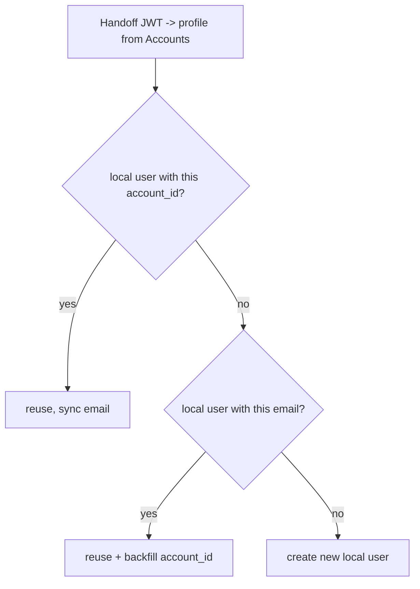

# SSO First-Sign-In User-Provisioning Audit

How every platform hosted by the Tendencys desktop shell provisions a **local user** the first time a customer signs in through Accounts SSO, the inconsistencies found, and the standard all platforms are being aligned to.

## Context

The Tendencys desktop app (`tendencys-desktop-app`) is a thin shell. It has **zero user-creation logic**. It:

1. Authenticates once against Accounts (`accounts.envia.com`).
2. Stores the Accounts session cookie (`_atid`) in a shared WKWebView cookie jar.
3. Loads each product in its own webview and lets each one do silent SSO via `/login-sites`.

Every product receives a short-lived handoff JWT on its callback and exchanges it the same way:

```
POST {ACCOUNTS_URL}/api/accounts/authorization
Authorization: <handoff JWT>
Referer: <product origin>   (some also send x-secret)
-> { id/_id, email, first_name, last_name, phone, country, token, ... }
```

What differs — and what this audit is about — is **how each product then finds or creates its local user** from that profile.

Service registry: `src/config/services.ts`.

## The standard

On first SSO sign-in, resolve the local user in this order:

1. Match by **`account_id`** (the Accounts `_id`) — stable even if the customer changes their email in Accounts.
2. Else match by **email**; if found, **backfill `account_id`** onto that record.
3. Else **create** a new local user.
4. Always keep the stored email in sync with Accounts.



## Per-service matrix

| Service | Repo | Callback | Local store | Match key (as found) | Backfill account_id | Status |
|---|---|---|---|---|---|---|
| Accounts (IdP) | `accounts` | n/a (source of truth) | Mongo `accounts` | n/a | n/a | Source |
| Ecart Pay | `ecart-payment` (BE) / `ecartpay-platform` (FE) | `/authentication` | Mongo `accounts` | account_id -> email -> create | Yes | Compliant |
| Ecart Banking | `ecart-banking` | `/api/auth/callback` | Supabase `users` | account_id only | n/a (keyed on account_id) | Compliant |
| Tendencys Partners | `tendencys-partners` | `/authentication` | MySQL `partners2.partners` | `accounts_account_id` only (unique) | n/a (greenfield) | Compliant |
| Ecart API | `ecartapi-dashboard` | `/authentication` -> `POST /api/auth/validate` | Mongo `users` | email only | No | Fixed |
| Envia Shipping | `envia` (PHP) | `/authentication` | MySQL `users`/`companies` | email only | Only if null | Fixed |
| Envia Returns | `envia` (same code, diff deploy) | `/authentication` | MySQL `users`/`companies` | email only | Only if null | Fixed |
| Envia Cargo | `carrier-compass-app` | `/authentication` (edge fn) | Supabase `public.users` | email only | Via upsert only | Fixed |
| Fulfillment | `fulfillment-api` (BE) / `envia-fulfillment` (FE) | `POST /authentication` | MySQL `users` (`app='fulfillment'`) | email only | No (link path) | Fixed |
| Parapaquetes | n/a | none (`authMode: unsupported`) | n/a | n/a | n/a | No SSO |

## How the redirect reaches each product (SSO trigger wiring)

The shell drives per-service SSO from `src/lib/tendencys-auth.ts` `buildServiceSsoUrl()`:

```
{ACCOUNTS_URL}/login-sites?site_id=<siteId>&redirect_url=<base64(authCallbackUrl)>
```

`AppShell.tsx` / `useProductSso` loads this on the first open of a service (lazy SSO), using the shared `_atid` cookie. Accounts then:

1. `POST /api/login/sites` → `middlewares.sites` → `functions.authorization.validateSite(site_id, redirect_url)` (`accounts/express/utils/authorization.util.js:111`).
2. `controllers.main.login` mints the handoff and returns `redirect_url` with `?authorization=<JWT>` appended (`accounts/express/controllers/main.controller.js:136-172`).
3. The webview follows the redirect to the product's `authCallbackPath`, which exchanges the handoff and provisions the local user.

**Key point:** `validateSite` gates only at the **project (Site) level** — the `site_id` must exist, the exact callback origin+path must be in that Site's `redirects` allowlist, and the Site must be `active`. There is **no per-user "already has an account on this site" check**, and `updateSiteAccess` (`accounts.util.js:772`) only records first/last login. So a signed-in identity gets a handoff for a project it has never used, and the product callback creates the local row.

The only thing needed to wire a **new** project for auto-provisioning is therefore Accounts config, not code:

- Register the project as a Site (`site_id`).
- Add its `authCallbackPath` (full `origin + path`) to that Site's `redirects` allowlist; audience/`Referer` must match the product origin.
- Mark the Site `active`.
- On the shell side, add the service to `src/config/services.ts`; keep `ssoReady: false` until the callback is live so the shell doesn't drive SSO into a missing route.

If any Site prerequisite is missing, `/api/login/sites` returns 401/403/404 and `login_sites_page.vue` falls back to the interactive `/login` — no silent handoff and no auto-create.

## Per-service callback -> local-create map

Where the browser lands and the exact site of the local-DB write (file:line at time of audit):

| Service | Callback (redirect target) | Local-DB create site | Post-create redirect |
|---|---|---|---|
| Envia Shipping / Returns (`envia`) | `GET /authentication` -> `MainContrlr::authentication()` | `POST {ENVIA_API_QUERIES}/sing-up`; actual `INSERT INTO users` lives in the **`queries`** repo (`controllers/singUp.controller.js:115`), not in `envia` | New: `/envios/cuenta-creada` interstitial -> React `/welcome`; existing: React `/home` |
| Envia Cargo (`carrier-compass-app`) | `/authentication` (React, `App.tsx:313`) -> edge fn `tendencys-validate-token` | `auth.admin.createUser` (`index.ts:270`) + `public.users` upsert (`index.ts:396-408`) | `verifyOtp` session -> `/onboarding` / `/dashboard` / role account-created |
| Envia Fulfillment (`fulfillment-api`) | Frontend `/authentication` (`envia-fulfillment/.../authentication/Page.js`) -> `POST /authentication` -> `auth.controller.js` `authentication()` | `INSERT INTO users … app='fulfillment'` in a transaction (`auth.controller.js:510-520`) | product JWT in `localStorage` -> `/welcome` |
| Ecart Pay (`ecart-payment`) | `GET /authentication` -> `main.controller.js:107` | `createFromAccounts` -> `create()` -> `new Accounts(data).save()` (`accounts.util.js:32` / `108-155`) | `_tid`/`_exp` cookies -> `/dashboard/home`, new -> `/setup` |
| Ecart Banking (`ecart-banking`) | `GET /api/auth/callback` -> `auth.controller.ts:55` | `supabase.from('users').insert(...)` (`auth.controller.ts:105-124`) | encrypted `_tid` cookie -> `/dashboard` |
| Ecart API (`ecartapi-dashboard`) | Nuxt `/authentication` page -> `POST /api/auth/validate` -> `authenticateLogin` | `new Users(...).save()` (`users.controller.ts:333-345`) | `__Host-ecart_token` cookie -> `/dashboard` |
| Tendencys Partners (`tendencys-partners`) | `/authentication` (React) -> `POST /api/authentication` | `INSERT INTO partners …` via `upsertByAccountsId` (`partner.repository.ts:278-287`) | `_tps` cookie -> `/welcome` |
| Parapaquetes | none (`authMode: unsupported`) | — | — |

### Behavioral gap: Envia Cargo is the only non-silent first sign-in

Every product auto-creates on the first callback **except Envia Cargo**. In `tendencys-validate-token` (`index.ts:227-241`), if the identity has no `public.users` row, no `user_type` on the request, and no pending team invitation, it returns `needs_user_type: true` and does **not** create the account. The React app routes to `/select-account-type`; the row is only written after the user picks carrier/merchant and the token is re-validated. This is a deliberate two-step flow, not a bug.

Two smaller notes:

- **Envia Shipping / Returns** is the only product whose insert lives in a *different* service (`queries` repo via `/sing-up`), which is not in this workspace.
- **Tendencys Partners** matches strictly on `accounts_account_id` (no email fallback) — fine for greenfield, but a pre-existing email-only partner row would not be linked.

## Inconsistencies / risks found

1. **Matching key was not standardized.** Three variants existed: `account_id`-only (Banking), `account_id -> email` (Pay), and **email-only** (Ecart API, Envia Shipping/Returns, Cargo, Fulfillment).
2. **Email-only matching creates duplicate users.** If a customer changes their email in Accounts, an email-only platform cannot find their existing record on the next sign-in and creates a second local user.
3. **Ecart API never backfilled `accounts_id`.** After an email match it left the record permanently unlinked to the Accounts id.
4. **Fulfillment's link path never set `account_id`, and its update keyed on email.** Returning users stayed unlinked, and its `accounts.update` email-sync webhook (which matches on `account_id`) silently updated zero rows for them. Rewriting the update to key by `id` + backfill fixes both.
5. **Fulfillment has two provisioning triggers.** First-SSO-login (`POST /authentication`) and, historically, the Accounts `account.register` webhook. `fulfillment-api` does not implement an `account.register` receiver today (only `accounts.update` for email changes), so there is no active duplicate-create race — noted for awareness.

## Recommendations (applied)

- Standardize every platform on **account_id primary match -> email fallback with backfill -> create**, keeping email in sync.
- Ecart API: add `accounts_id`-first lookup and backfill on email match.
- Fulfillment: add `account_id`-first lookup and rewrite the link update to key by `id`, sync email, and backfill `account_id`.
- Envia (Shipping/Returns): resolve by `account_id` before email.
- Cargo: look up `public.users` by `tendencys_account_id` first and sync the Supabase Auth email when it changed.

## No change required

- **Ecart Pay** (`ecart-payment`): `getAccount()` already does account_id -> email -> create + backfill.
- **Ecart Banking** (`ecart-banking`): matches `users.account_id` and updates email each login.
- **Tendencys Partners** (`tendencys-partners`): `upsertByAccountsId` keys on unique `accounts_account_id`; greenfield, so no legacy email-only rows exist and no email fallback is needed.

## Notes

- Each platform is a separate stack (Node/Express+Mongo, Nuxt+Express+Mongo, CodeIgniter PHP, Supabase edge function, Hapi+MySQL, Hono+MySQL) with its own deploy. There is no single atomic change; the standard is enforced per repo.
- Verification coverage is uneven: only `fulfillment-api` has a test runner (Jest); Ecart API, Cargo, and the Envia PHP app rely on lint + manual staging checks.
